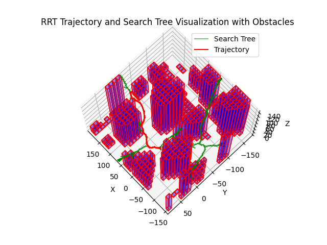

# 3D Trajectory Planning for Autonomous Quadcopters Using RRT

## Project Summary

In this project, I tackled the complex challenge of developing a 3D trajectory planning system for an autonomous quadcopter. This journey began with a clear goal: to navigate a quadcopter through a 3D environment laden with obstacles, ensuring efficient and safe trajectories from a start position to a goal position. Leveraging the Rapidly-exploring Random Tree (RRT) algorithm, I integrated several technical components, including obstacle parsing, pathfinding, and trajectory generation, all brought together with a custom steering function that uses Rodrigues' rotation formula.

Through this project, I demonstrated my engineering mindset and problem-solving abilities by breaking down the problem into manageable components, rigorously testing each part, and integrating them into a cohesive system. The result is a sophisticated trajectory planner capable of generating realistic and feasible flight paths for a quadcopter, showcasing my ability to handle complex technical challenges and think like an engineer.


The following image typifies the results of the project:



## Theory

### RRT Trajectory Planning

I implemented the Rapidly-exploring Random Tree (RRT) algorithm, which is a popular method for efficiently exploring large search spaces. The RRT algorithm incrementally builds a tree rooted at the start position and expands towards random samples in the search space. This approach allowed me to explore the environment effectively and find a path from the start to the goal position. To ensure the quadcopter's path adhered to realistic motion constraints, I integrated a custom steering function.

### Custom Steering Function

My custom steering function is based on Rodrigues' rotation formula, which I used to compute the rotation of a vector in three-dimensional space. This formula ensured smooth and feasible transitions between states, making the trajectory realistic and efficient.

#### Rodrigues' Rotation Formula

Given an initial orientation vector $\mathbf{v}$ and a target vector $\mathbf{u}$, I computed the axis of rotation $\mathbf{k}$ as:

$$
\mathbf{k} = \frac{\mathbf{v} \times \mathbf{u}}{\|\mathbf{v} \times \mathbf{u}\|}
$$

The angle $\theta$ between $\mathbf{v}$ and $\mathbf{u}$ is given by:

$$
\theta = \arccos\left(\frac{\mathbf{v} \cdot \mathbf{u}}{\|\mathbf{v}\| \|\mathbf{u}\|}\right)
$$

Using Rodrigues' rotation formula, I calculated the rotated vector $\mathbf{v}_{\text{new}}$ as:

$$
\mathbf{v}_{\text{new}} = \mathbf{v} \cos\theta + (\mathbf{k} \times \mathbf{v}) \sin\theta + \mathbf{k} (\mathbf{k} \cdot \mathbf{v})(1 - \cos\theta)
$$

This formula allowed me to smoothly rotate the orientation of the search tree state towards the target direction, with the rotation angle clipped to a maximum allowable value to simulate realistic motion constraints.

#### Euler Integration

With the new orientation vector $\mathbf{v}_{\text{new}}$, I used Euler integration to establish a new state for the search tree of the RRT. Euler integration is a simple and efficient numerical method used to solve ordinary differential equations. In this context, it advances the state by a small time step $dt$, ensuring smooth transitions and realistic movements.

**Update Position**: Given the current position $\mathbf{p}$ and the orientation vector $`\mathbf{v}_{\text{new}}`$, the new position $`\mathbf{p}_{\text{new}}`$ is calculated as: 

$$
\mathbf{p}_{\text{new}} = \mathbf{p} + \mathbf{v}_{\text{new}} \cdot \text{speed} \cdot dt
$$

By combining Rodrigues' rotation formula and Euler integration, the RRT algorithm expands the search tree smoothly and realistically. This method ensures effective navigation through the 3D space while avoiding obstacles, resulting in a more efficient and feasible trajectory planning system for the quadcopter.


## Requirements

### C++ Dependencies

- **nanoflann**: A C++ header-only library for KD-trees, used for efficient nearest-neighbor searches in the RRT algorithm.

### Installation Instructions

- **nanoflann**: Download from the [nanoflann GitHub repository](https://github.com/jlblancoc/nanoflann) and follow the installation instructions.

### Python Dependencies (for Visualization)

- **Matplotlib**: A plotting library for creating visualizations.
- **Numpy**: A library for numerical computations.

To install these Python libraries, use pip:

```sh
pip install matplotlib numpy
```

## Usage

1. **Compile the Project**: Open the solution `RRT.sln` in Visual Studio and compile the project.
2. **Run the Main Program**: Execute `main.cpp` to parse obstacles, find a path using RRT, and generate a trajectory.
3. **Visualize the Results**: Use the provided Python scripts to visualize the obstacles and trajectory.

   - `show_trajectory.py`

Each run of the main program will generate CSV files that are used by the visualization scripts. Ensure that these scripts are executed after running the main program to see the latest results.

